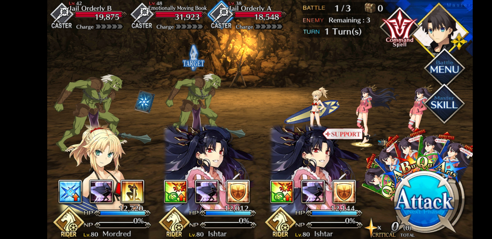
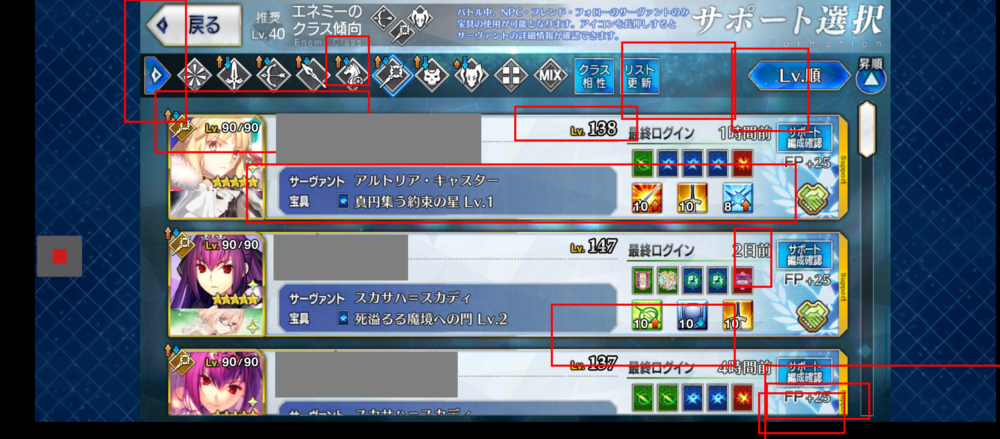

## How FGO should look with wide-screen update

**JP, CN, KR, NA:** Should fill the entire screen including the notch.    
**TW:** Turn ON `More options/Advanced/Ignore notch calculation` if FGO doesn't leave the notch area black.

Only use Ignore Notch on TW servers, otherwise it has no effect.

There should be no black bars on the screen.

## FGO looks different on my phone

### CASE 1: Borders around FGO are black

On some devices, FGO isn't covering the full screen. This could be because of system settings or because of Android 12 Gesture Navigation.

This is an example which causes problems for FGA:  

If your device is made by Huawei, LG, Samsung or Xiaomi, you can fix the black bars with System Settings.

Fullscreen settings per manufacturer:
<table>
  <tr>
    <th>Manufacturer</th>
    <th>Guide</th>
  </tr>
  <tr>
    <td>Huawei</td>
    <td>
      <ul>
        <li>Open <em>Settings</em> app</li>
        <li>Go to <em>Display & brightness > More display settings > Full-Screen Display</em></li>
        <li>Turn ON the switch for FGO</li>
      </ul>
    </td>
  </tr>
  <tr>
    <td>LG</td>
    <td>
      <ul>
        <li>Open <em>Settings</em> app</li>
        <li>Go to <em>Display > App scaling</em></li>
        <li>Set FGO to Full Screen</li>
      </ul>
    </td>
  </tr>
  <tr>
    <td>Samsung</td>
    <td>
      <ul>
        <li>Open <em>Settings</em> app</li>
        <li>Search for and select <em>Full screen apps</em></li>
        <li>Turn ON the switch for FGO</li>
      </ul>
    </td>
  </tr>
  <tr>
    <td>Xiaomi</td>
    <td>
      <ul>
        <li>Open <em>Settings</em> app</li>
        <li>Go to <em>Display > Fullscreen mode</em></li>
        <li>Turn ON the switch for FGO</li>
      </ul>
    </td>
  </tr>
</table>

If you have any other device, try switching to 3-Button Navigation (Triangle, Circle, Square). If that doesn't work or you want to keep using Gesture Navigation Mode, check the [Custom Game Area megathread](https://github.com/Fate-Grand-Automata/FGA/issues/1347).

### CASE 2: Your phone has borders around FGO even at the bottom of screen

LGv60                                  | Google Pixel 4L
---------------------------------------|-----------------------
 | 

The black border are for gesture navigation.

To get rid of them:
- Go to `Settings > System > Gestures > System Navigation`.
- Change to `3-button navigation`.

If that doesn't work, check the [Custom Game Area megathread](https://github.com/Fate-Grand-Automata/FGA/issues/1347).

### CASE 3: Your phone is Android 7 or 8 and has a notch

Notch detection is only possible on Android 9 and above. Either update your phone or find a way to disable notch in your phone's settings.