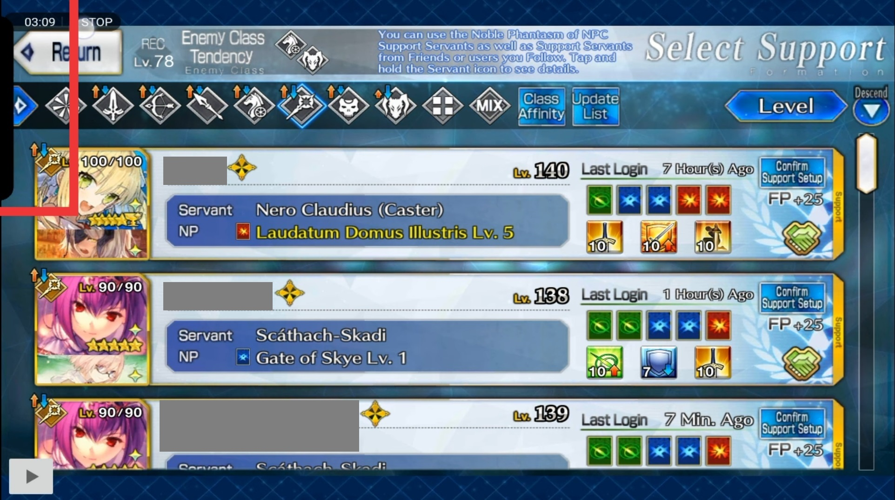

## Step 1
Force-stop FGA or restart your phone and see if that works.  
This is a quick-fix for battery optimization issues.

## Other screen recorders
Don't use other screen recorders with FGA, if you do, force-stop FGA if it doesn't work properly.  
When recording for bug-reports for FGA, use the inbuilt recorder from `More options/Advanced/Record screen`.

## Where's 'Script Mode', Lottery, FP, Support Image Maker?
The app automatically detects which script can be run on the current screen.  
It will show the relevant option when you click on the PLAY button.  
Support Image Maker shows up as a button on the bottom-left corner of the popup if you click on the PLAY button on the support screen.

## Where's the PLAY button?
The PLAY button only appears when you switch your phone to horizontal mode, for example when you start FGO. If it still doesn't appear you can try a combination of stopping and starting accessibility and force-closing FGA until it appears.

If the button disappears overnight or when you lock your screen, then battery optimization is at fault. See [#314](https://github.com/Fate-Grand-Automata/FGA/issues/314).

## The PLAY button is in the way when I watch videos

On the FGA notification, press the arrow in the top right, then click Stop.
If you want to enable the play button again, open the FGA app and start the service

See [Example](https://discord.com/channels/1117873862500163684/1117932403571294228/1119641849032867971)

## Having trouble on Emulators?

See [Running on Emulators](Running-on-Emulators)

## Can I run FGA on Apple devices?
No, the app uses Android-only code. There are some auto-clickers for Apple, but it won't have the intelligence of FGA.

If you still want to use FGA, run it on an emulator or use normal auto-clickers.

Video guide for creating auto-clicker rules with voice controls: https://www.youtube.com/watch?v=JSFiys-j0JM

## Why are newer FGA versions a different app on my phone?
From now on, the canary APK is published under the package io.github.fate_grand_automata.debug on Github.

This means you'll have to transfer your settings from the old app manually.

The package change was required so I can publish the app as beta-only in the play store. Google doesn't allow me to publish the old app as beta unless I also make it publicly available, which attracts users who refuse to read instructions and leave 1-2 star ratings.

If Google accepts the play store submission for the new app, it will be published with the package io.github.fate_grand_automata (no .debug at the end), which will fix problems with restricted accessibility permissions and will install new builds through the play store.

Installing it through the play store is the only way to use FGA on Android 14 right now, that's the main reason why I had to trigger these major changes.

## I'm trying to use FGA for the first time and I can't click OK after clicking on the PLAY button
You need to select a battle config on the left to use.

## Where did the "Stop after CE drop" feature go?
It's now part of the window appearing after pressing the PLAY button in FGO and allows you to set it to stop after X amount of CE drops

## Can I migrate my settings from the Quick icon version to the Buster icon one?
No, such a functionality was not implemented, but you can do it yourself:

- Install the Buster version from the play store, but keep the Quick version for now
- Export all battle configs in the Quick app
- Import them to the Buster app
- Transfer the rest of the settings manually by checking all settings in the old app and configuring the new app the same way

## Will I get banned for using FGA?
FGO's Terms of Service contains this line, so everything could be banworthy to them:
(17) Any other act which Aniplex considers inappropriate.

However, nobody got banned yet for using 3rd party apps. They mainly ban for account trading.

## Do I need root mode for FGA? My phone is not rooted.
You don't need root, but you can't record videos of FGA in Android 13 without it.

Some emulators need root mode to work and if you have a rooted phone, you should enable root mode because you'll get fewer issues.
See https://youtu.be/iIjZPjDcZeM for how to record on android 13 and up without root

## Can you use FGA to do story nodes?
No, because of several reasons:
- FGO requires you to search for and select the next story node on the map, which requires complicated swiping and tapping. There's no way a computer knows where to find it and how to navigate to it.
- Starting with Camelot, Story chapters become difficult and can't be beaten with Level 120 Servants consistently. At that point you'll have to look up enemy patterns and build specialized teams.
- The SKIP button in the top right can't be detected reliably, so FGA will get stuck at dialogue options (top or bottom answer)

# IMPORTANT: Make sure the game looks as FGA wants it to

If you're having trouble, this is mostly related.
See [Game Area detection](Game-Area-detection)

## Clicking on PLAY doesn't open the popup to start scripts?
Game booster/Game mode or other app blocking notifications/popups when a game (FGO) is running.
Turn them OFF. Known to happen on some LG, Samsung and Motorola.

For LG:
Turn OFF Game Tools since it has the feature to prevent ALERTS from showing up.  
This prevents the dialog which lets you pick AutoSkill config from showing up.  
https://www.lg.com/us/support/help-library/lg-g7-thinq-gaming-tools-CT10000027-20150726480680

On other phones, if you have something like a Game Booster that blocks alerts from other apps when playing a game, turn it OFF.
Instructions would vary depending on your device, so Google.

## Worked before, doesn't work now

See [#314](https://github.com/Fate-Grand-Automata/FGA/issues/314)

## Keeps asking for Accessibility even after turning it ON

See [#314](https://github.com/Fate-Grand-Automata/FGA/issues/314)

## Uses skills on the wrong servant or doesn't use skills at all

Do you have skill confirmation ON in FGO?  
If so, either turn that OFF or turn ON `More options/Skill confirmation` in FGA.

## Not picking NP/cards on Attack screen OR Got stuck in some info screen

Is it just your phone lagging badly? If so, either get a new phone or try increasing the delays in `More options/Fine-tune`.

## Doesn't work on some screens

1. Check that you're not placing the PLAY button in a weird place.  
   See [Where should I place the PLAY button?](#where-should-i-place-the-play-button)

2. Is there some overlay on your phone/emulator screen that can screw up image matching?  
   For example:
   
   

## Where should I place the PLAY button?

Bottom-left corner is ideal. While you can drag the button around to other places, there is a possibility of screwing things up if it comes in the way of image matching.

## Why is FGA opening Servant details at the start of the battle?

That's an intended feature for detecting which face cards belong to which Servant.

Every time a new Servant enters the field, FGA will also open up their details to take a screenshot of their face.

It can be disabled in `More Options`, but you won't be able to use several features relying on face card matching.

